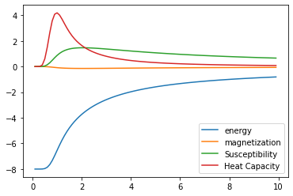

Getting Started
===============

This page details how to get started with Monte_Carlo. 

Installation
------------
To install Monte_Carlo, you will need an environment with the following packages:

* Python >= 3.7

Once you have these packages installed, you can install Monte_Carlo in the same environment using
::
        
        git clone https://github.com/shef4/monte_carlo.git
        cd monte_carlo
        pip install -e .

Theory
----------

Introduction to the Monte Carlo method
```````````````````````````````````````````
Start by defining the Gibbs distribution:
:math:`P(\alpha) = e^{-E(\alpha)/kT}`.
this expression, defines the probability of observing a particular configuration of spins, :math:`\alpha`. 
As you can see, the probability of observing the :math:`\alpha` configuration decays exponentially with increasing energy of :math:`\alpha`, :math:`E(\alpha)`,
where `k` is the Boltzmann constant, :math:`k = 1.38064852 \times 10^{-23} J/K`
and `T` is the temperature in Kelvin. 

What defines the energy of a configuration of spins? 
```````````````````````````````````````````````````````
Given a configuration of spins (e.g., :math:`\uparrow\downarrow\downarrow\uparrow\downarrow`) we can define the energy using what is referred to as an Ising Hamiltonian:

:math:`\displaystyle\hat{H}' = \frac{\hat{H}}{k} = -\frac{J}{k}\sum_{<ij>} s_is_j + \tfrac{\mu}{k}\sum_i s_i,`

where, :math:`s_i=1` if the :math:`i^{th}` spin is `up` and :math:`s_i=-1` if it is `down`, and the brackets :math:`<ij>` indicate a sum over spins that are connected,
and `J` is a constant that determines the energy scale. 
The energy here has been divided by the Boltzmann constant to yield units of temperature. 

Properties
``````````````
For any fixed state, :math:`\alpha`, the `magnetization` (`M`) is proportional to the _excess_ number of spins pointing up or down while the energy is given by the
Hamiltonian:

:math:`M(\alpha) = N_{\text{up}}(\alpha) - N_{\text{down}}(\alpha)`.

As a dynamical, fluctuating system, each time you measure the magnetization, the system might be in a different state (:math:`\alpha`) and so you'll get a different number!
However, we already know what the probability of measuring any particular :math:`\alpha` is, so in order to compute the average magnetization, :math:`\left<M\right>`, we just need to multiply the magnetization of each possible configuration times the probability of it being measured, and then add them all up!
:math:`\left<M\right> = \sum_\alpha M(\alpha)P(\alpha)`.
In fact, any average value can be obtained by adding up the value of an individual configuration multiplied by it's probability:

:math:`\left<E\right> = \sum_\alpha E(\alpha)P(\alpha)`.

This means that to obtain any average value (also known as an `expectation value`) computationally, we must compute the both the value and probability of all possible configurations. This becomes extremely expensive as the number of spins (`N`) increases. 

Sampling
`````````````
These exact calculations pose a drastic problem from a practical perspective.
As `N` becomes large it is evident that
computations become a daunting task if calculated in this manner.
Thus a better numerical alternative would be to use a simulation to generate data over
the ‘representative states’.
Because each computed value of a configuration gets weighted by it's probability, very high energy states (which have negligible probabilities due to the Boltzmann distribution) will not contribute to the overall sum.
What we'd like to do instead, is to sample over *only* those configurations that actively contribute.
This is a form of biased sampling which
essentially boils down to satisfying the following condition where
**generated frequency = actual probability**.

An expectation value of any quantity, `A`, computed (using the Canonical Ensemble) can be defined as:

:math:`\left<A\right> = \frac{1}{Z}\int e^{-E(\alpha)/T}A(\alpha)d\alpha`,

where `Z` is referred to as the `partition function`, and is essentially a normalization constant:

:math:`Z = \int e^{-E(\alpha)/T}d\alpha`, 

and

:math:`P(\alpha) = \frac{1}{Z}e^{-E(\alpha)/T}`,

gives the actual statistical weight with which the configuration
:math:`\alpha` occurs in the thermal equilibrium. We now want to consider the discrete case
of the formal definitions above. If we are to consider a finite portion of the
configuration space it would produces an average of the form:

:math:`\left<A\right> = \frac{\displaystyle\sum_\alpha e^{-E'(\alpha)/T}A(\alpha)}{\displaystyle\sum_\alpha e^{-E'(\alpha)/T}}`

We could choose to randomly `sample` from this full set of configurations, but this will not converge quickly.
By randomly sampling, we simply mean to pick a configuration, :math:`\alpha`, at random, where all configurations have equal probability of being selected. 
However, what if we *knew* a priori what the equilibrium probability distribution was?
Then we could select configurations not randomly, but rather where a given configurations probability of being selected was proportional to its equilibrium population, 
:math:`\frac{1}{Z}e^{-E(\alpha)/T}`.
If each configuration had the thermodynamic probability of being sampled, then our average value would reduce to a simple arithmetic average over the samples:

:math:`\displaystyle \left<A\right> = \frac{1}{M} \sum_\alpha A(\alpha)`.

How can we carry out this fancy, biased sampling? - Markov process!
We will *walk* randomly through configuration space. 
Each configuration that we visit we will compute properties that contribute to our average values. 
From each we visit, we will consider a new randomly chosen configuration and decide whether or not to visit that new configuration.
The rules we use to determine whether or not to visit a new configuration will be chosen to guarantee that the number of times we visit a 
configuration is exactly proportional to the equilibrium population of that configuration! 

The choice to visit a new configuration will be made probabilistically. 
Assume we are currently visiting configuration :math:`\alpha`. 
We select configuration :math:`\beta` at random, and want to decide whether or not to visit :math:`beta`. 
If the :math:`\beta` is lower in energy than :math:`\alpha`, then we will visit the new configuration with 100% probability, :math:`W(\alpha\rightarrow\beta)=1`. 
If the :math:`\beta` is *higher* in energy, then we will visit the new configuration with a probability given by, 

:math:`W(\alpha\rightarrow\beta)=e^{-\left(E(\beta)-E(\alpha)\right)/T}`.

This seems simple, but it's quite powerful! We want to use this to make our simulations much faster, at the cost of some statistical noise. 

#. Initialize configuration, :math:`\alpha`
#. Loop over Monte Carlo steps

        #. Loop over sites, `i`

                #. Propose new configuration, :math:`\beta`, by flipping site, `i`. 
                #. Compute flipping probability, :math:`W(\alpha\rightarrow\beta)`. If a randomly chosen number between 0 and 1 is less than :math:`W(\alpha\rightarrow\beta)`, then visit :math:`\beta`
                #. Update :math:`\alpha` to :math:`\beta`

        #. Update average values with updated :math:`\alpha`


Examples
-----------
Configuration Energy
````````````````````
Example for how to compute the energy for a single spin configuration for a 1D (nearest neighbor graph)
::

    import numpy as np
    import matplotlib as mpl
    from matplotlib import pyplot as plt
    import monte_carlo
    import random
    
    # Define number of sites
    N = 8

    # Define configuration
    conf = monte_carlo.BitString(N=N)
    conf.set_config([0, 0, 0, 0, 0, 0, 1, 1])

    # Choose a J-coupling constant, `Jval`:
    Jval = 1.0
    mu = [.1 for i in range(N)]
    J = []
    for i in range(N):
        J.append([((i+1) % N, Jval), ((i-1) % N, Jval)])
    ham = monte_carlo.IsingHamiltonian(J=J, mu=mu)
        
    Ei = ham.energy(conf)
    print(" Energy of      ", conf.config, " is ", Ei)

    # Now we can use our integer-binary encoding to define a configuration
    # and get the energy
    conf.set_int_config(106)
    print(" Index 16 = ", conf)
    Ei = ham.energy(conf)
    print(" Energy of      ", conf.config, " is ", Ei)

This should print out the following: 
::

 Energy of       [0 0 0 0 0 0 1 1]  is  3.6
 Index 16 =  01101010
 Energy of       [0 1 1 0 1 0 1 0]  is  -4.0


Thermodynamic for temp T
``````````````````````````
Here, we compute the average energy, magnetization, magnetic susceptability, and heat capacity for a small 6 site lattice. 
::

        import numpy as np
        import matplotlib as mpl
        from matplotlib import pyplot as plt
        import monte_carlo
        import random

        # Define my hamiltonian values
        N = 6
        Jval = 2
        mu = [1.1 for i in range(N)]
        J = []
        for i in range(N):
                J.append([((i+1) % N, Jval), ((i-1) % N, Jval)])
        ham = monte_carlo.IsingHamiltonian(J=J, mu=mu)

        # Define a new configuration instance for a 6-site lattice
        conf = monte_carlo.BitString(N=N)

        # Compute the average values for Temperature = 1
        E, M, HC, MS = ham.compute_average_values(conf, 1)


        print(" E  = %12.8f" %E)
        print(" M  = %12.8f" %M)
        print(" HC = %12.8f" %HC)
        print(" MS = %12.8f" %MS)
    
This should produce the following output:
::
 
        E  = -11.90432015
        M  =  -0.02660820
        HC =   0.59026994
        MS =   0.05404295

Plot of observables vs T
``````````````````````````
At this point we have the ability to compute the average values of various quantities of a spin lattice at a given temperature.
One is often interested in how these properties change as a function of Temperature.
::

        # First initialize some empty lists to store our computed quantites
        e_list = []
        e2_list = []
        m_list = []
        m2_list = []
        T_list = []

        # Now pick some new values for our hamiltonian
        N = 8
        Jval = 1
        mu = [.1 for i in range(N)]
        J = []
        for i in range(N):
                J.append([((i+1) % N, Jval), ((i-1) % N, Jval)])
        ham = monte_carlo.IsingHamiltonian(J=J, mu=mu)

        conf = monte_carlo.BitString(N=N)

        for Ti in range(1,100):
                T = .1*Ti

                E, M, HC, MS = ham.compute_average_values(conf, T)

                e_list.append(E)
                m_list.append(M)
                e2_list.append(HC)
                m2_list.append(MS)
                T_list.append(T)


        print(e_list)
        plt.plot(T_list, e_list, label="energy");
        plt.plot(T_list, m_list, label="magnetization");
        plt.plot(T_list, m2_list, label="Susceptibility");
        plt.plot(T_list, e2_list, label="Heat Capacity");
        plt.legend();
        plt.savefig('prop_vs_T.pdf')

This should produce the following plot:


